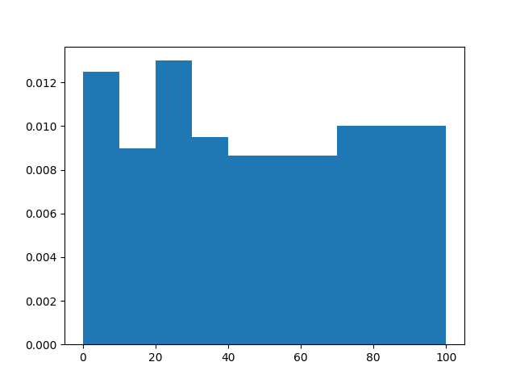
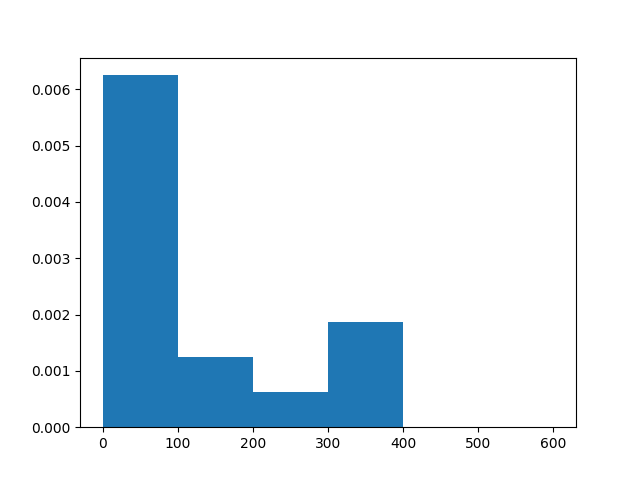
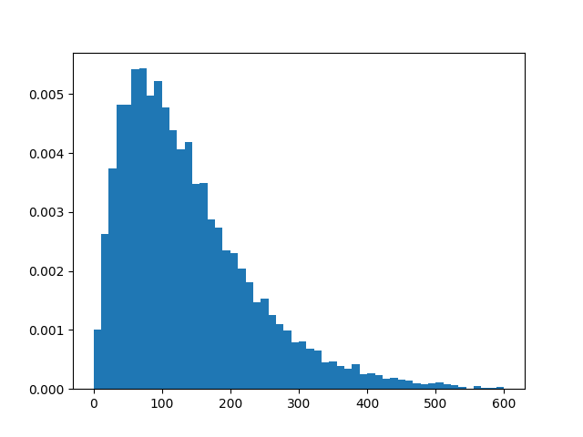
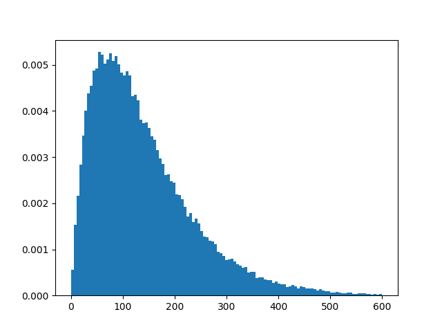

---
output:
  html_document: default
  pdf_document: default
---
# Questions

## Question 1

*Fill in the two functions `compute_histogram_bins` and `plot_histogram` in `histogram.py`. As an example, we would like to be able to plot something similar to histogram_example.png` as a minimum result.*

In this question I wanted to use the *histogram* function provided by numpy because it didn't seem to be forbidden. Numpy is written in C so it's overwhelmingly faster than anything I could write in python. But that also means that the improvements I can make are really limited. That's why I decideed to write the algorithm myself.

## Question 2

*Go to the file `question2.py`:
1. fill in `send_data_to_backend` so that it returns the list of the peer's connection durations.
2. fill in `process_backend_data` which must do all necessary processing to return the connection durations histogram bins counts. **Don't call `plot_histogram` in this method, we just want to compute the histogram bins counts**.*

To implement these functions I decided to simply send all the data without modification when collecting it and just concatenate all the data points.

Then, to choose the bins I prefered to take them with same width. This is simpler than equiprobable bins.

Sturge's rule advices to use $k=2n^{1/3}$. Even though it performs best on normal distributons it's easier to compute here compared to Doane's formula for example.

Then, I simply used the *compute_histogram_bins* edited earlier.

## Question 3

*With peers sending such datastructure and our _backend_ server making such operations, we retrieve exactly **all** the connection durations on the network at the moment of the snapshot and we are able to plot the _exact distribution_ of the connection durations.
1. `question2.py` main has several simulations with increasing numbers of peers and peer pool size. Run the simulations with your implementation. What do you see? Can you explain the limitations of the implementations of question 2 taking into account that a _real_ peer network can have _millions_ of peers? (answer below in this file)*

| #Peers | Max_peer_pool_size | time(ms)|
|--------|--------------------|--------:|
| 10     | 2                  | 0.08    |
| 1000   | 10                 | 55.95   |
| 1000   | 100                | 888.90   |
| 1000   | 1000               | 5775.21  |
| 10000  | 10                 | 1020.25   |
| 10000  | 100                | 20180.35  |

By looking at the results we can see that the computing time needed to process the data inceases quickly with the number of peers and the size of the pools. This was to be expected because with $N$ peers and a maximum size of $M$ for the pools we can expect in average $NM/2$ data points (given that the pool sizes are equiprobable like here).

With millions of peers we can expect a processing time of several minutes. There's maybe a more clever way to compute the bins and prepare the histogram that can save a lot of time while keeping a good quality of representation.

## Question 4

*Go to the file `question4.py`:
1. propose new implementations of `send_data_to_backend` and `process_backend_data` that can deal with millions of peers _and_ still provide a good representation of the _distribution_ of the connection duration. You are free to add any written comments, add pictures etc...to enhance your answer.*

The original idea behind my solution was that we have a lot of precision on the data points that maybe isn't necessary. Let's assume, to simplify things, that the distribution we want to represent is fairly smooth (the extrem case being the uniform distribution). Thus the bin widths might be roughly the same (This is a big assumption). Then we can estimate the precision that is necessary. For 10 million peers and a maximum of 100 peers per pool we have roughly 500,000,000 data points. Thus $k \approx 700$. This means that for a number of peers up to 10,000,000 a precision of 0.1 should be enough (The values being between 0.1 and 600s).

Thus each peer sends a 6,000-array (each vallue of the array being the number o time this values is present in it's pool). We can expect a significant number of collisions if the maximum size of pools is not too small compare to 6,000. Even though each peer sends more data it is easier to compute the sum of all these arrays. It's a bit cheating but numpy sums are quicker than what I could have done.

Then I compute the bins and counts the similarly to question 2.

Here are the resulting speeds:

| #Peers | Max_peer_pool_size | time(ms)|
|--------|--------------------|--------:|
| 10     | 2                  | 3.04    |
| 1000   | 10                 | 42.12   |
| 1000   | 100                | 47.54   |
| 1000   | 1000               | 42.04  |
| 10000  | 10                 | 739.23   |
| 10000  | 100                | 558.96  |

Result histogram for a gamma distribution (#peers=10, max=2)

Result histogram for a gamma distribution (#peers=1000, max=10

Result histogram for a gamma distribution (#peers=1000, max=100

Result histogram for a gamma distribution (#peers=10000, max=100

